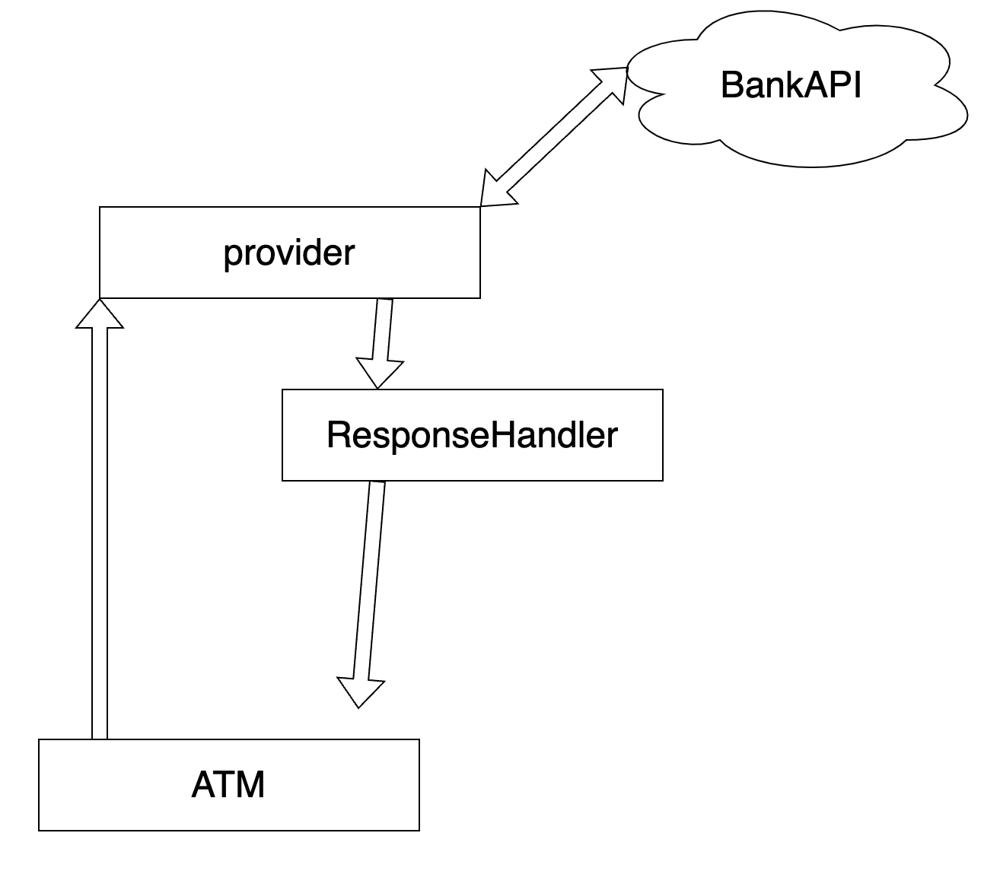

# ATM Project

# Install

```bash
pip3 install -r requirements
```

# How To run test

you can run command on terminal

```powershell
pytest test/atm/test.py
```

or You can use vscode or other IDE for test.

pytest.ini is created at root directory!

# Architecture



ATM will request to provider to request any data from bank

ATM must not dependent to Bank API.

After Provider get response from bank, response handler will parse response data for ATM.

ResponseHandler could be dependent to API.